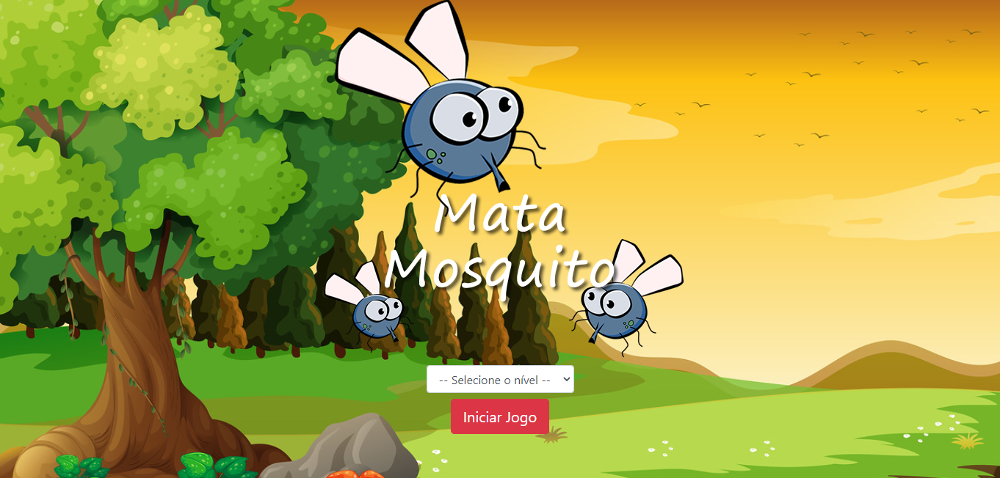
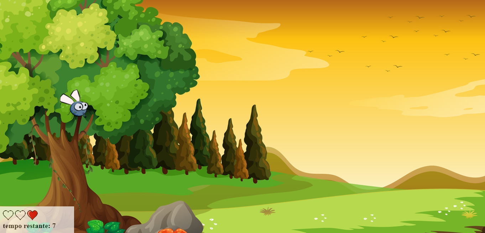
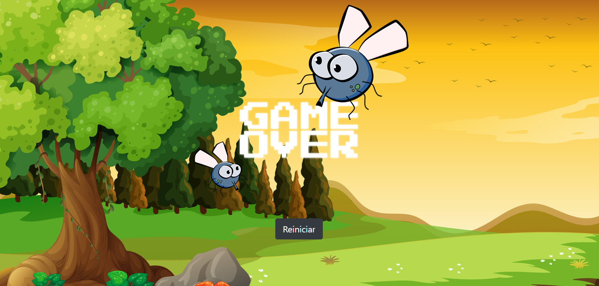

# Welcome to my first game with Javascript! 😁
This is an application of a game, Mata Mosquito. In this game the objective is to eliminate the mosquitos before time runs out.

## starting the game 🎯
On the home screen we have the option of three modes: normal, hard and expert

## playing 🎮
When choosing the mode, the game starts with a countdown of the timer and three lives

## Win or Lose 🏆
When you win or lose you will be notified and can be redirected to the home page

